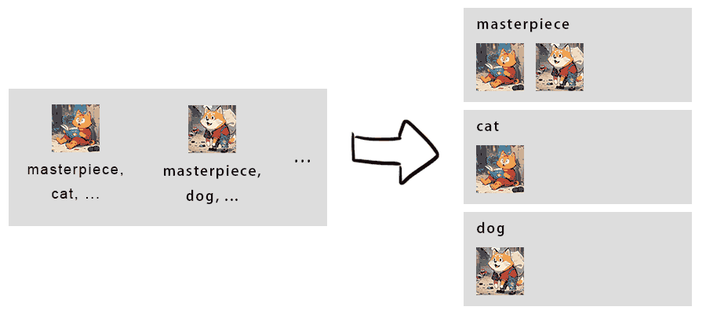

# LabelPair


A booru-style tagging tool in browser, which used for training stable diffusion checkpoints, hypernetworks, embeddings, lora, etc.

Try here: [https://icesandwich.github.io/LabelPair/](https://icesandwich.github.io/LabelPair/)

**All files will process in your local browser.**

# Usage
## Prepare dataset

   Use your favorite tagging model to tag your images automatically first. Personally i use [this](https://github.com/hollowstrawberry/kohya-colab/blob/main/Dataset_Maker.ipynb).

   No matter what method you use, your dataset should look like this:

   ┏━━ :open_file_folder: dataset
   ┣━━━━ :flower_playing_cards: 1.png
   ┣━━━━ :page_facing_up: 1.txt
   ┣━━━━ :flower_playing_cards: 2.png
   ┣━━━━ :page_facing_up: 2.txt
   ┗━━━━ ...

​	The txt contains tags of the image with the same filename, its content looks like this:

```txt
solo, looking at viewer, open mouth, sitting, outdoors, collar, chair, cat, orange fur, male focus, cat, cute, blush, full body, smile, :3, sunlight
```

## Upload dataset

Open [Demo Link](https://icesandwich.github.io/LabelPair/) and drag images and texts(*.txt) **together** to specific area of the page.

All files process in your local browser, don't worry. I don't have money to buy a server.

## Happy tagging

In **MultiSelect** mode, you can select some images to add/remove/rename tag. If you don't select any images, will use all images by default.

**Retrieve** can retrieve images that doesn't contain this tag. Useful to balance you tags.

**Analysis** shows your tags distribution at the moment.

## Save

Click `Export` at the top. This will only save txt files. You may consider override source tag files or use diff compare tool to double check.

 