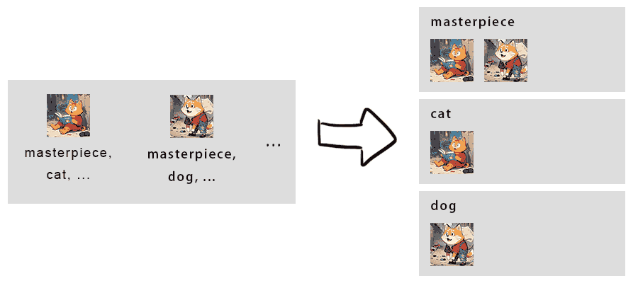

# LabelPair


A booru-style tagging tool in browser, which used for training stable diffusion lora, etc.

Try here: [https://icesandwich.github.io/LabelPair/](https://icesandwich.github.io/LabelPair/)

**All files will process in your local browser.**

# Features

- Browser only. No installation required. Run at any devices.
- Different view to tag like doing a captcha easily.
- Batch tagging and merge to check. Useful for incremental tagging.
- Tag distribution analysis.
- Organize your trigger words in order.
- Retrieve images with same semantic meaning.
- Simplify workflow. No project concept. Drag files and start tagging.
- Check unreasonable tags with rules. eg. `indoors` and `outdoors` are opposite and should not be in one image. (plan in future)
- AI pre-tagging automatically in browser. (plan in future)
- Organize your trigger words in natural language. (plan in future)

# Usage
1.  Prepare dataset

    Use your favorite tagging model or method to tag your images automatically first. Personally i use [this](https://github.com/hollowstrawberry/kohya-colab/blob/main/Dataset_Maker.ipynb) which base on [kohya_sdscript](https://github.com/kohya-ss/sd-scripts/blob/main/finetune/make_captions.py).

    No matter what method you use, your dataset should look like this:
    ```
    dataset
        1.png
        1.txt
        2.png
        2.txt
        ...
    ```

    ​	The txt contains tags of the image with the same filename, its content looks like this:

    ```txt
    solo, looking at viewer, open mouth, sitting, outdoors, collar, chair, cat, orange fur, male focus, cat, cute, blush, full body, smile, :3, sunlight
    ```

2. Upload dataset

    Open [Demo Link](https://icesandwich.github.io/LabelPair/) and drag images and texts(*.txt) **together** to specific area of the page.

    All files process in your local browser, don't worry. I don't have money to buy a server.

3. Happy tagging

    In **MultiSelect** mode, you can select some images to add/remove/rename tag. If you don't select any images, will use all images by default.

    **Retrieve** can retrieve images that doesn't contain this tag. Useful to balance you tags.

5. Save your world

    At the top:

    **Analysis** shows your tags distribution and adjust trigger words order.

    **Export** save result as txt files.
    
    With txt files, You may consider override source tag files or use diff compare tool to double check.

# Build

**If you don't know code, you don't have to build.**

The section is for those who want to change to source code.

This project doesn't use webpack. Only one thing you need to do is to run `tsc --build`.

And then use http server to run `index.html`.